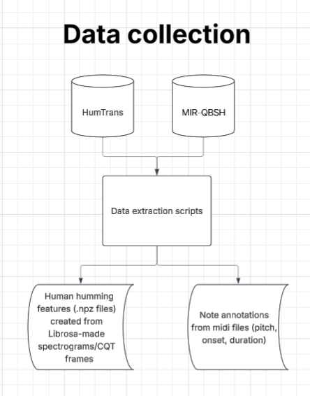
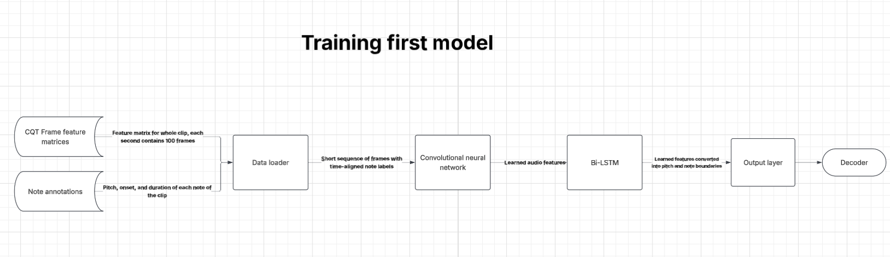
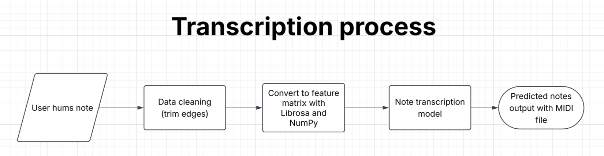

# Hyrule Warriors: Human Humming to Musical Note Transcription
## Introduction
Our team aims to create a deep learning model that can take human humming as an input and transcribe it into notes. We were inspired by the new <i>The Legend of Zelda: Ocarina of Time</i> game which includes a feature allowing the player to hum the notes of a song to activate a certain mechanic: <https://youtu.be/PQvD3p2yGwc?si=BmR2eiGZjW1xTqee&t=793>

We want to make a model that can be used in a similar way so that a user can hum into their microphone and have a transcribed series of notes instantaneously.

## Required dependencies
### Install with pip
Use pip to install the following packages

#### Data Collection
* huggingface_hub (for HumTrans dataset)
```
pip install huggingface_hub
```
* remotezip
```
pip install remotezip
```
* pretty_midi
```
pip install pretty_midi
```
* librosa (for spectrogram creation)
```
pip install librosa
```
#### Math
* numpy
```
pip install numpy
```
* scipy
```
pip install scipy
```


## Data Collection



### HumTrans
In `./raw_data/HumTrans/test/` is `extraction.ipynb`. This is a sample notebook that shows the process of downloading humming `.wav` files and their associated MIDI files. There are also two example files `one_hum.wav` and `one_midi.wav`.

`collect_HumTrans_midi.py` converts the MIDI files stored in `raw_data/HumTrans/all_midi.zip` into a CSV which splits up each individual note of the song and stores the file it is from, the pitch, the pitch name (what note it is), the onset, and the duration. `collect_HumTrans_wav.py` converts the human humming samples from the HumTrans API into features stored in `.npz` files that we can feed to our neural network later on.

### MIR-QBSH
This is a zip file (`raw_data/MIR-QBSH/MIR-QBSH.zip`) containing human singing and the MIDI files associated with them. There are roughly 50 songs used in this data set and a handful of people singing the songs. `collect_MIR_QBSH_midi.py` and `collect_MIR_QBSH_wav.py` process the data the same way the scripts used for HumTrans do. 

The zip file is not in the repo to save space. To download it, go to <http://mirlab.org/dataset/public/> and store it in the `raw_data/MIR-QBSH/` folder.

### Hum Generation
In `./raw_data/Librosa/test/` is `librosa_hum_demo.ipynb`, a demo program showcasing how we can use NumPy and SciPy to generate audio waves. From those audio waves, we can use Librosa to create a spectrogram representation of that audio wave to feed our model. There is also a sound file created at the end so we can hear what the generated hum sounds like.


## Training


## Transcription process
